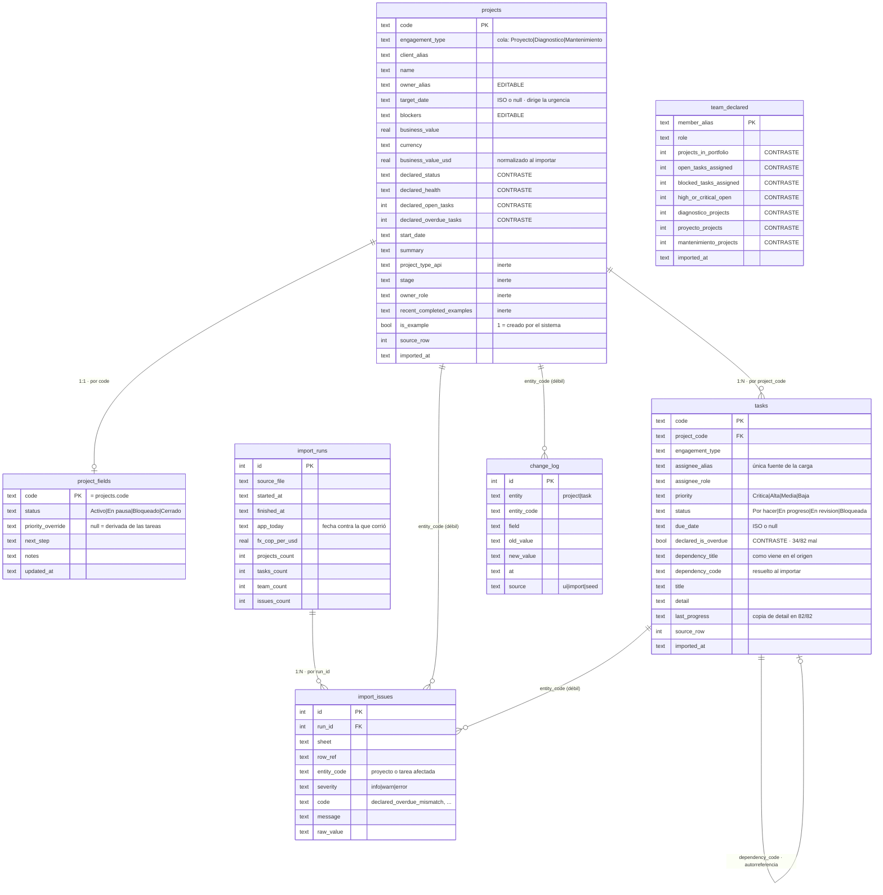

# Modelo de datos

Siete tablas en SQLite. La forma del esquema es la tesis del sistema escrita en DDL: **lo que
declara el origen, lo que decide el humano y lo que se calcula viven separados, y solo los dos
primeros se persisten.**

---

## Diagrama

---

## Las tres clases de datos

El esquema no está organizado por entidad de negocio, sino **por quién es dueño del dato**. Es
la decisión que sostiene todo lo demás.

| Clase | Tablas | Quién escribe | Qué pasa al reimportar |
|---|---|---|---|
| **Origen** | `projects`, `tasks`, `team_declared` | El importador | **Se sobreescribe.** La fuente es dueña |
| **Humano** | `project_fields` | Las server actions | **Sobrevive intacto.** Es el punto del diseño |
| **Derivado** | *ninguna* | Nadie | No existe. Se recalcula en cada lectura |

### Por qué `project_fields` es una tabla aparte y no columnas de `projects`

Es la separación más importante del esquema. Si `next_step` o `notes` vivieran en `projects`, el
`ON CONFLICT DO UPDATE` del importador los pisaría en la siguiente corrida: el próximo export
del origen borraría las decisiones del equipo. Al estar en otra tabla con la misma clave, el
upsert no las alcanza — la garantía es estructural, no depende de acordarse de excluir columnas.

Hay una excepción deliberada: `owner_alias`, `target_date` y `blockers` **sí** viven en
`projects` aunque el humano los edite. Son campos que el origen también trae, así que reimportar
los actualiza a propósito. Los otros cuatro (`status`, `priority_override`, `next_step`,
`notes`) no existen en el archivo: los crea el sistema, y por eso son suyos.

### Por qué no hay tabla de derivados

Flags, severidad, score y carga por persona **no se persisten en ningún lado**. Se calculan en
`lib/engine/` contra la fecha que entrega `lib/clock`, en cada lectura.

Guardarlos sería reproducir exactamente el bug que el sistema existe para detectar: `is_overdue`
en el origen es un valor que fue cierto el día que se escribió y envejeció en silencio. Un
`projects.risk_level` en esta base sería el mismo error con otro nombre.

### Por qué las columnas `declared_*`

Se importan y **ninguna decide nada**. Existen para que la consola pueda poner lado a lado lo
que dice el origen y lo que da el recálculo. `declared_health` dice "Sano" en un proyecto con
171 días de atraso; sin la columna no habría con qué mostrar la contradicción.

El prefijo es la convención que lo hace verificable: cualquier lectura de un campo `declared_*`
fuera del importador o de la capa que muestra discrepancias sería un bug, y se encuentra con un
grep.

---

## Relaciones: por convención, no por `FOREIGN KEY`

**No hay restricciones `FOREIGN KEY` declaradas.** Las relaciones se resuelven en el importador
y en `lib/data/`, y es deliberado:

- **El origen llega sucio.** Una tarea puede apuntar a un `project_code` que no existe en la hoja
  Projects. Con FK, la fila se rechaza y el dato se pierde en silencio. Sin FK, entra y el
  importador registra un `orphan_task` en `import_issues` — visible, contable y auditable, que
  es la regla del sistema: **nada se descarta sin dejar rastro**.
- **`import_issues` y `change_log` referencian entidades que pueden desaparecer.** Un proyecto que
  deja de venir en el origen no debe borrar su historial de calidad ni su bitácora de cambios.
  La referencia es intencionalmente débil.

La contrapartida —que la integridad depende del código y no del motor— se cubre en el único
lugar donde importa: las escrituras pasan todas por `lib/actions.ts`, en transacción. Un
`createProject` que insertara en `projects` y fallara antes de `project_fields` dejaría un
proyecto huérfano que rompe la consola entera; la transacción lo hace imposible.

### `tasks.dependency_code` — la autorreferencia

El origen declara dependencias **por título**, no por código. El importador las resuelve dentro
del mismo proyecto y guarda las dos versiones: `dependency_title` como llegó, `dependency_code`
ya resuelto. Conservar el original permite auditar la resolución en vez de tener que confiar en
ella.

Sobre ese grafo corre la detección de ciclos (`lib/engine/dependencies.ts`) que encuentra el
deadlock de PRJ-04 — dos tareas que se esperan entre sí, un bloqueo que ninguna columna del
archivo declara.

---

## Trazabilidad

Tres tablas que no modelan el negocio sino **cómo llegó el dato**:

| Tabla | Responde |
|---|---|
| `import_runs` | Cuándo corrió la importación, sobre qué archivo, con qué fecha (`app_today`) y qué tasa de cambio |
| `import_issues` | Qué se normalizó, qué faltaba y qué se contradice — con `raw_value` para poder volver al original |
| `change_log` | Append-only: qué campo cambió, de qué a qué, cuándo y desde dónde (`ui`, `import`, `seed`) |

`import_runs.app_today` y `fx_cop_per_usd` se guardan por la misma razón: un hallazgo de calidad
solo es interpretable si se sabe contra qué fecha y qué tasa se produjo. Sin eso, una corrida
vieja parece equivocada cuando en realidad era correcta el día que corrió.

`change_log` es append-only porque **el estado actual no cuenta la historia**. Que un proyecto
diga hoy "En pausa" no dice si lleva tres meses así o si alguien lo cambió hace diez minutos, y
esa diferencia es justamente la que importa para priorizar.
